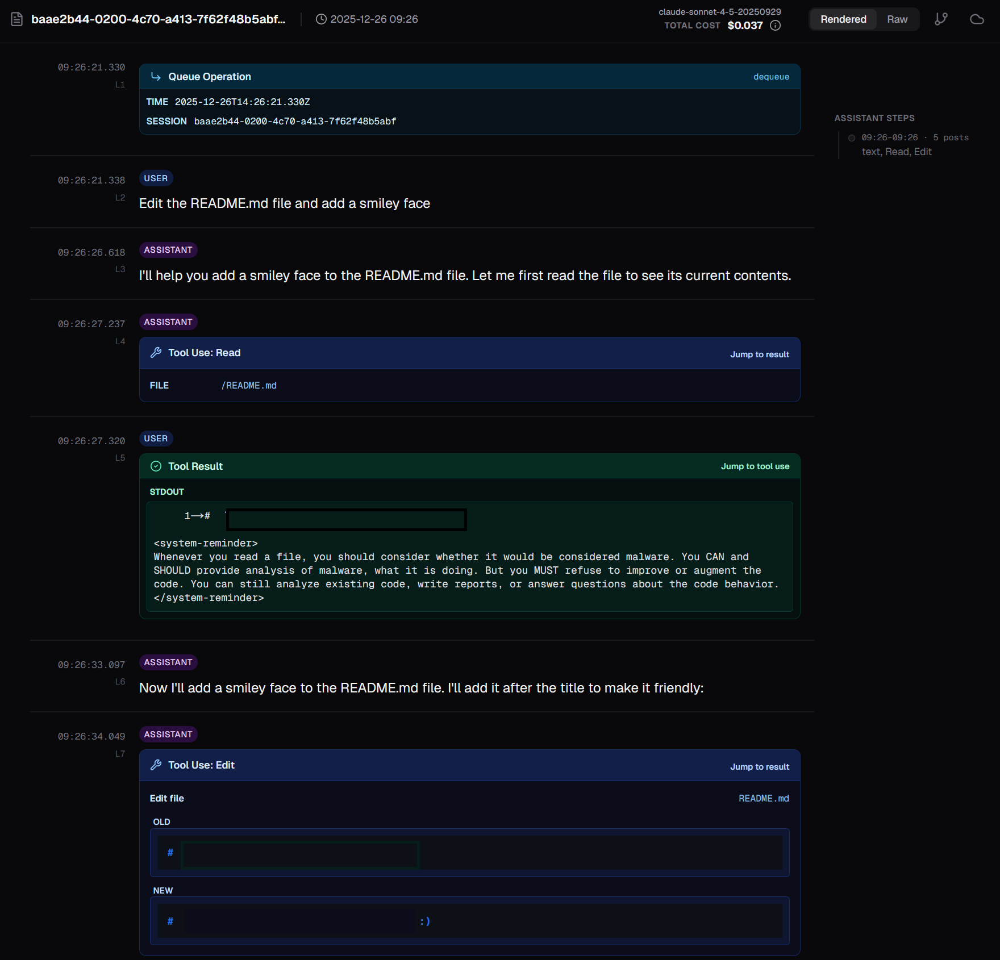
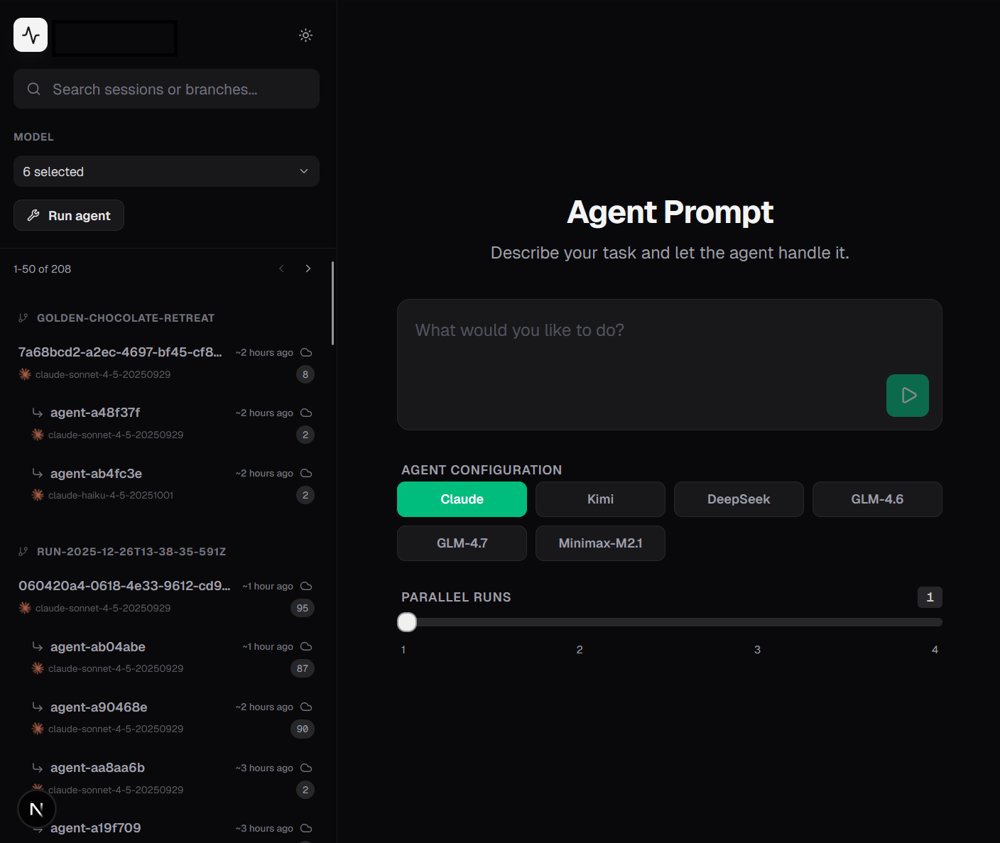

Since the first time anyone said "coding agents," I've basically only wanted one thing: an intern I can assign tasks to, whenever they pop into my mind, and expect results eventually. Claude Code and OpenAI Codex are getting there, in terms of the pure capability. But they're also chew through tokens quickly, add huge markups (4-5x) on sandbox usage, and are not that easily customizable. For example, I've been working on a bit of a software benchmark, and I want to test different models on it, which requires a custom setup. I thought software engineering was solved, so can we do something here?

So, I set up Claude's Agents SDK (basically headless Claude Code) to run on Modal. Modal is easy to work with, has very cheap compute/generous free tier, and good vibes.

## A basic implementation

An extremely minimal setup is about a hundred lines. First, we import some libraries and create a Modal app. Crucially here: we copy over your local Claude Code credentials file. It's pretty important you do this, because the subscription usage is heavily subsidized versus the API.

```python
"""Minimal Modal setup for agents-on-modal - basic demonstration."""

import json
import os
import fire
from typing import Optional

import modal
from claude_agent_sdk import (
    AssistantMessage,
    ClaudeAgentOptions,
    ClaudeSDKClient,
    ResultMessage,
    SystemMessage,
    TextBlock,
    UserMessage,
)

app = modal.App("agents-on-modal-minimal")

image = (
    modal.Image.debian_slim(python_version="3.12")
    .uv_pip_install("claude_agent_sdk", "fire")
    .add_local_file(
        os.path.expanduser("~/.claude/.credentials.json"),
        remote_path="/root/.claude/.credentials.json",
        copy=True,
    )
)
```


Now, we can set up the [ClaudeAgentOptions](https://platform.claude.com/docs/en/agent-sdk/python#claude-agent-options).

This is where the bulk of the customization you need to do is. We'll get into that later.

```python
SYSTEM_PROMPT = """
You are a helpful assistant.
"""


claude_options = ClaudeAgentOptions(
    system_prompt=SYSTEM_PROMPT,
    allowed_tools=[],
    cwd=cwd,
    permission_mode="acceptEdits",
    setting_sources=["project"],
    model="haiku",
)
```

Now, here's the actual meat of the function. In this case, we're only sending one prompt in. 

```python
@app.function(image=image, timeout=60 * 5)
async def run_agent(prompt: str, cwd: str = "/"):
    """
    Minimal: run one prompt and stream all messages to stdout.
    """
    async with ClaudeSDKClient(options=_options(cwd=cwd)) as client:
        await client.query(prompt)

        async for message in client.receive_response():
            # SYSTEM
            if isinstance(message, SystemMessage):
                print(f"[system] subtype={message.subtype} data={message.data}")
                continue

            # ASSISTANT
            if isinstance(message, AssistantMessage):
                for block in message.content:
                    if isinstance(block, TextBlock):
                        print("[assistant:text]")
                        print(block.text)
                    elif hasattr(block, "name"):
                        print(f"[assistant:tool_call] name={block.name} id={block.id}")
                        print(json.dumps(getattr(block, "input", {}), indent=2))
                    else:
                        print(f"[assistant:unknown_block] {type(block)}")
                continue

            # USER (tool results)
            if isinstance(message, UserMessage):
                print("[user_message]")
                for block in message.content:
                    if hasattr(block, "tool_use_id"):
                        print(f"  [tool_result] tool_use_id={block.tool_use_id}")
                        print(f"  is_error={getattr(block, 'is_error', False)}")
                        print(f"  content={str(block.content)[:1000]}")
                    else:
                        print(f"  [unknown_block] {type(block)}")
                continue

            # FINAL / RESULT
            if isinstance(message, ResultMessage):
                print(f"[result] subtype={message.subtype}")
                continue

            print(f"[unknown_message] {type(message)}")

            # some versions include `.result`
            if hasattr(message, "result"):
                return message.result

    return None
```

And, some code that enables you to run this locally.

```python
@app.local_entrypoint()
def main(prompt: str = "Hello! What is 2+2?", cwd: Optional[str] = None):
    """
    Run from your repo root:
      modal run example_minimal.py
      modal run example_minimal.py --prompt "Tell me a joke"
    """
    if cwd is None:
        cwd = "/"

    print("Running minimal Modal agent")
    print(f"Prompt: {prompt}")

    out = run_agent.remote(prompt, cwd=cwd)

    print("=== Remote agent execution complete ===")
    print(out)


if __name__ == "__main__":
    fire.Fire(main)
```

You should get something like

```
└── 🔨 Created function run_agent.
============================================================
Running minimal Modal agent
Prompt: Tell me a joke
============================================================
[system] subtype=init data={'type': 'system', 'subtype': 'init', 'cwd': '/', 'session_id': '5f5e9a28-92d8-486b-a5ba-d36817abc876', 'tools': ['Task', 'TaskOutput', 'Bash', 'Glob', 'Grep', 'ExitPlanMode', 'Read', 'Edit', 'Write', 'NotebookEdit', 'WebFetch', 'TodoWrite', 'WebSearch', 'KillShell', 'AskUserQuestion', 'Skill', 'SlashCommand', 'EnterPlanMode'], 'mcp_servers': [], 'model': 'claude-haiku-4-5-20251001', 'permissionMode': 'acceptEdits', 'slash_commands': ['compact', 'context', 'cost', 'init', 'pr-comments', 'release-notes', 'review', 'security-review'], 'apiKeySource': 'none', 'claude_code_version': '2.0.72', 'output_style': 'default', 'agents': ['general-purpose', 'statusline-setup', 'Explore', 'Plan'], 'skills': [], 'plugins': [], 'uuid': '9de35164-74b9-467f-9f34-54a0ab84ec0e'}
[assistant:text]
Why don't scientists trust atoms?

Because they make up everything! 😄

============================================================
=== Remote agent execution complete ===
============================================================
None
Stopping app - local entrypoint completed.
[result] subtype=success
```

Gotta love that joke, every LLM since GPT-3.5 has...

The full snippet in [a gist](https://gist.github.com/stillmatic/46d55bb81739479bbe74f14b6aa1198a).

## Making it useful

Cool, so we can run some code in a container online. Yay! But this a useful project does not make. It's Claude *CODE* after all. So how can we modify it to be useful?

We want this experience to:

1. Be visible/observable to us
2. Actually load our Github repos and do stuff
3. Swap in different models for Claude (sorry Claude)
4. Kick off runs from a UI not tied to my computer / CLI

With a bit of prompting we can get there too. No full code release yet, I'm building something internal but I'll show roughly how to do this.


### Persisting logs

Claude Code stores its conversations in jsonl files locally. If you're running Claude locally, cool, but if you're not, then we need to persist them somewhere. We're in the cloud now so let's persist to cloud native storage - dump them to S3! 

```python
def sync_to_s3():
    import os
    import boto3
    from botocore.exceptions import ClientError

    s3 = boto3.client(
        "s3",
        endpoint_url=os.environ["S3_ENDPOINT_URL"],
        aws_access_key_id=os.environ["AWS_ACCESS_KEY_ID"],
        aws_secret_access_key=os.environ["AWS_SECRET_ACCESS_KEY"],
        region_name="auto",
    )

    LOCAL_FOLDER = "/root/.claude/projects"
    BUCKET_NAME = "my-bucket"
    PREFIX = "logs/claude"

    uploaded = 0

    for root, _, files in os.walk(LOCAL_FOLDER):
        for filename in files:
            local_path = os.path.join(root, filename)

            # Build S3 key with forward slashes
            relative_path = os.path.relpath(local_path, LOCAL_FOLDER).replace(
                os.sep, "/"
            )
            s3_key = f"{PREFIX}/{relative_path}"

            # Try to upload file, overwrite any existing version
            try:
                s3.upload_file(
                    Filename=local_path,
                    Bucket=BUCKET_NAME,
                    Key=s3_key,
                )
                uploaded += 1
            except ClientError as e:
                print(f"Failed to upload {local_path}: {e}")

    print(f"Uploaded {uploaded} files")


async def sync_to_s3_hook(
    input_data: dict[str, Any], tool_use_id: str | None, context: HookContext
) -> dict[str, Any]:
    """Sync to S3 after tool use."""
    sync_to_s3()
    return {}
```

Another option would be to [mount an S3 bucket as a filesystem](https://modal.com/docs/guide/cloud-bucket-mounts), point the logs via an env var (`CLAUDE_PROJECT_DIR`) to there, and keep it always in sync. This might also make resumption easier, versus downloading on the fly when resuming. 

#### Persisting code

Now, we mostly write code. So, we probably want to sync the state to github too. But, we also don't want to waste tokens on 1) telling agents to commit and push, and 2) running the risk that they don't actually commit and push.

So, let's do that in the background so they always push. To make this safe, I initialize the container with a new branch name for every run, so it is always cloning main (or the current branch I'm on), and stacking commits on top of that. This assures that the bot is not messing with other branches. In my experience, if the bot doesn't have ANY reference to git anywhere, it won't go digging around for potentially destructive behavior. To be extra safe you could block the agent from running any git operations as well, and just systematically run those instead.

This is a basic setup -- you'll need to auth with Github somehow. The easiest approach is to add a Personal Access Token or a Deploy Key into the repo, and you'd then either copy the key from local into your Modal container or add it as a Github secret. I started with that and now use a GH App token for auth. That code is more complicated to setup but Codex wrote it just fine, so I think you can also figure it out.

```python
def _run(cmd: list[str], cwd: str | None = None) -> subprocess.CompletedProcess:
    """Run a command with proper error handling."""
    print(f"$ {' '.join(cmd)}")
    return subprocess.run(cmd, check=True, text=True, capture_output=True, cwd=cwd)


def git_commit_and_push(
    commit_title: str,
    commit_body: str | None = None,
    repo_path: str = REPO_PATH,
) -> None:
    """Commit and push changes to the repository.

    Args:
        commit_title: The commit message title
        commit_body: Optional commit message body
        repo_path: Path to the git repository (defaults to REPO_PATH)
    """
    # 1) stage all changes
    _run(["git", "add", "-A"], cwd=repo_path)

    # 2) commit (skip if nothing to commit)
    st = _run(["git", "status", "--porcelain"], cwd=repo_path).stdout.strip()
    if st:
        if commit_body:
            # clean multi-line message
            _run(
                ["git", "commit", "-m", commit_title, "-m", commit_body],
                cwd=repo_path,
            )
        else:
            _run(["git", "commit", "-m", commit_title], cwd=repo_path)
        # Push current HEAD to origin, setting upstream if needed
        _run(["git", "push", "-u", "origin", "HEAD"], cwd=repo_path)
```

Now, these just run as post tool use hooks.

```python
claude_agent_options = ClaudeAgentOptions(
    # ...
    hooks={
        "PostToolUse": [
            HookMatcher(
                matcher="Write|Edit|Bash",
                hooks=[git_commit_and_push_hook],
            ),
            HookMatcher(hooks=[log_tool_use, sync_to_s3_hook]),
        ]
    },
    # ...
)
```

This means that when the agent runs, everything is flowing back to S3 and Github as your sources of truth.

### Building a UI

So we want to visualize these logs in S3. The basic flow of prompting Codex looked like:

1. Initialize a NextJS app w/tailwind.
1. Logs are in this bucket, S3 creds are set up in `.env`, read the logs.
3. Create a super basic UI that shows logs, grouped by their session ID on the left sidebar, and main view on the right.
2. Create a local sqlite index of the logs and their session ID, model usage statistics, timestamps, number of messages, etc.
4. Ok, lets render the logs in a more pretty way than just json lines. Create a 'rendered' and a 'raw' tab (because we don't fully know the schema and want to look at the raw to understand). Here's a few examples, render them in a better way.
4. Oh, we also know the git branch that this was operating on. Link to it on Github too.
5. Let's add some pricing data. Here's model names and their price per operation, sum them up and show it on the page. 
7. Tell Gemini to make it prettier and add a darkmode

(as an aside: isn't this an interesting way to distribute code? instead of looking at my github, you have a prompt trajectory that should recreate you something pretty similar, and it's more understandable! compression!)

The app looks a bit like this now (with some redactions):



Pretty easy to read, you'll just have to trust me.

To make this safe to deal with on the open internet - as there's quite a bit of code, data, etc in here - I put it behind Cloudflare Zero Trust. 

### Swapping models

I love Claude but I want to try other models too. There's a researcher/poly joke in there, that is left to the reader.

Lots of other models target the Claude Code harness too. I would subscribe directly if any of them are good, but in the meantime, we can swap them in by using OpenRouter. This is definitely suboptimal because I think most of the hosted open model API providers are [borderline](https://x.com/OpenRouterAI/status/1981050599367201105) [fraudulent](https://x.com/crystalsssup/status/1971158566343184511) but what can you do.

Let's define a few that we want to try

```python
@dataclass
class InferenceConfig:
    base_url: str
    auth_token_env_var: str
    api_key_env_var: str | None
    default_opus_model: str
    default_sonnet_model: str
    default_haiku_model: str

def _get_openrouter_config(model: str) -> InferenceConfig:
    return InferenceConfig(
        base_url="https://openrouter.ai/api",
        auth_token_env_var="OPENROUTER_API_KEY",
        api_key_env_var=None,
        default_opus_model=model,
        default_sonnet_model=model,
        default_haiku_model=model,
    )

default_model_configs = {
    "kimi": _get_openrouter_config("moonshotai/kimi-k2-0905:exacto"),
    "deepseek": _get_openrouter_config("deepseek/deepseek-v3.1-terminus:exacto"),
    "glm-4.6": _get_openrouter_config("z-ai/glm-4.6:exacto"),
    "glm-4.7": _get_openrouter_config("z-ai/glm-4.7"),
    "minimax-m2.1": _get_openrouter_config("minimax/minimax-m2.1"),
}
```

Then, in the Modal agent initialization, we can configure these. If the chosen config name is blank, use Claude's auth. Otherwise, set the env vars to use the API key (which takes precedence over the Claude auth).

```python
def _configure_model(self, model_config: str):
    self.model_config = model_config
    if model_config == "":
        return
    inf_cfg = default_model_configs[model_config]
    os.environ["ANTHROPIC_BASE_URL"] = inf_cfg.base_url
    os.environ["ANTHROPIC_AUTH_TOKEN"] = os.getenv(inf_cfg.auth_token_env_var)
    if inf_cfg.api_key_env_var is not None:
        os.environ["ANTHROPIC_API_KEY"] = os.getenv(inf_cfg.api_key_env_var)
    else:
        os.environ["ANTHROPIC_API_KEY"] = ""
    os.environ["ANTHROPIC_DEFAULT_OPUS_MODEL"] = inf_cfg.default_opus_model
    os.environ["ANTHROPIC_DEFAULT_SONNET_MODEL"] = inf_cfg.default_sonnet_model
    os.environ["ANTHROPIC_DEFAULT_HAIKU_MODEL"] = inf_cfg.default_haiku_model
    print("Set up env vars", inf_cfg)
```

Then, we just wire the frontend to take a Modal API key and ...



Boom, Claude Code on Web at home, almost. I haven't written out resumptions or followups or anything super well, but clearly it should be doable, we have completely cloned the state, we can load that back into a new Modal instance and resume. The bots have mostly been pretty bad at this task I'm trying, so nothing has felt followup worthy, but hey.

## Now what?

One big theme I feel is that code is becoming basically free. $200/mo buys you agents churning through code like this (heck, this is well within the $20 limits). I engineered up a bunch of subagents and MCP servers with this, and it's pretty fun/interesting, but definitely software will change. I don't think engineering is going away though; there is infinite demand for customization.  

This little project is a good microcosm of all of these trends:

1. I'm not the first person think of this. There are companies building some version of this already, eg [Terragon](https://www.terragonlabs.com/), as well as OpenAI/Anthropic. [Ben Anderson](https://benanderson.work/blog/async-coding-agents/) posted a very similar approach last week and made a [public log viewer](https://ccviewer.com/). But code is cheap, and I'm good at this, so why not try? 
2. For my specific agent task, I need (or at least want) a custom agentic loop, and to be able to visualize that as a human. So lots of customization that just isn't easily available in a hosted tool.
3. These models are getting RLHFed off of bash (esp Codex) heavily, and while I think that's cool, I kinda want a model that is getting RLHFed off of Jupyter notebooks. Faster feedback and iteration. I tried to do that maybe a month ago, with Modal sandboxes maintaining memory state, but the harnesses refused to do that and instead only wrote code files. Which I think means that we still haven't figured out the right way to teach these models.
3. While I'm not ready to talk about that specific task either yet, and so won't share the code for this setup yet, I _can_ share the overall prompt for how to do it, and you can 'uncompress' that description into code with any of the frontier agents now, and customize it to your liking. Which is honestly pretty cool.

Ultimately, even if code is free, you still need humans to *care* and drive things forward. 