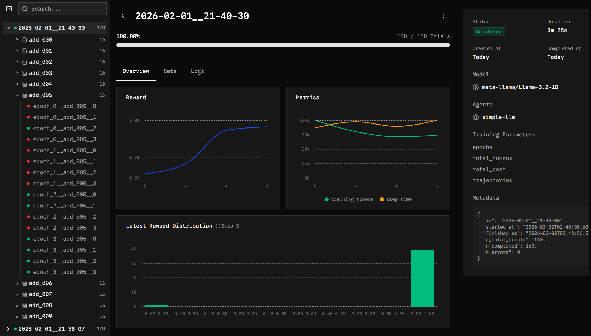
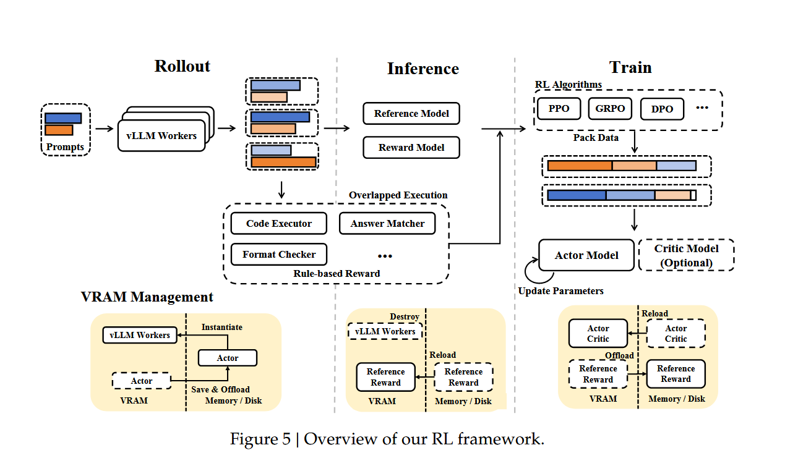
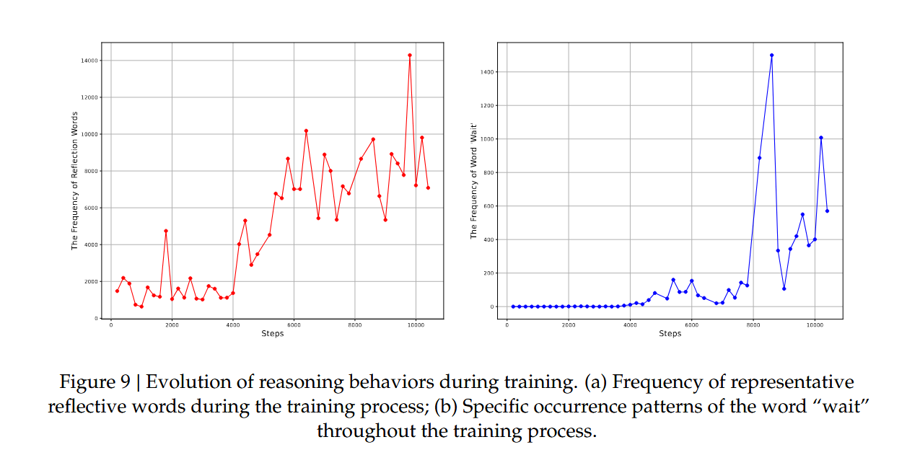
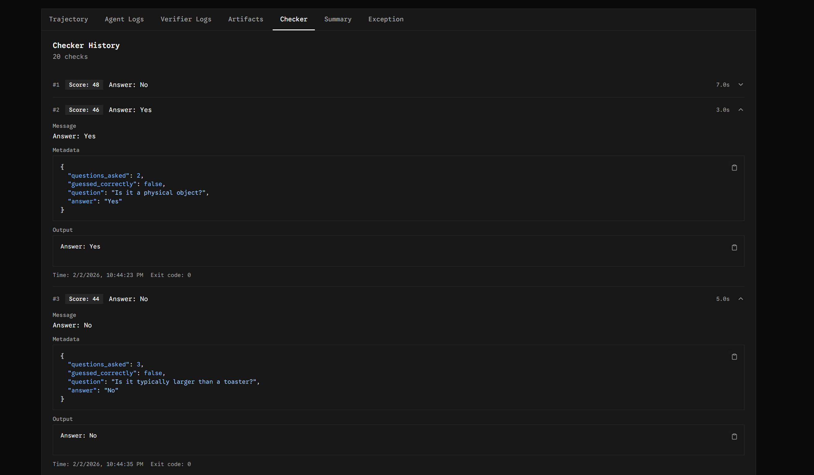
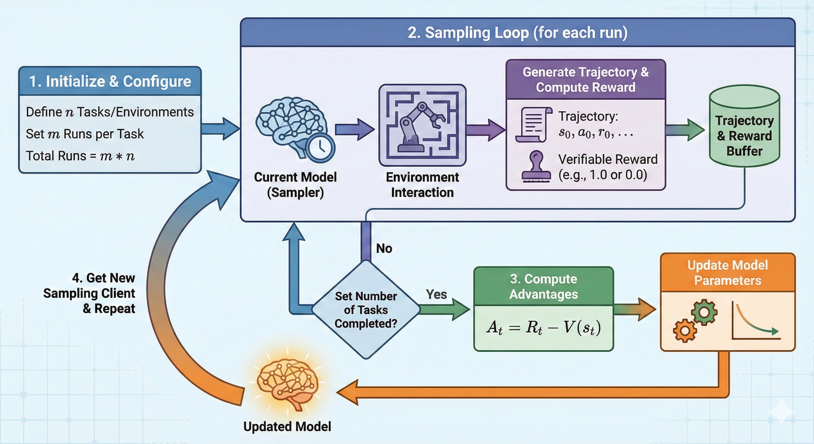
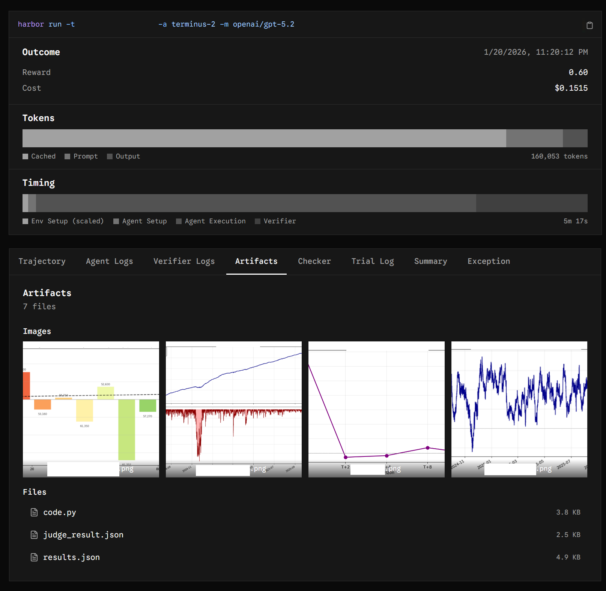
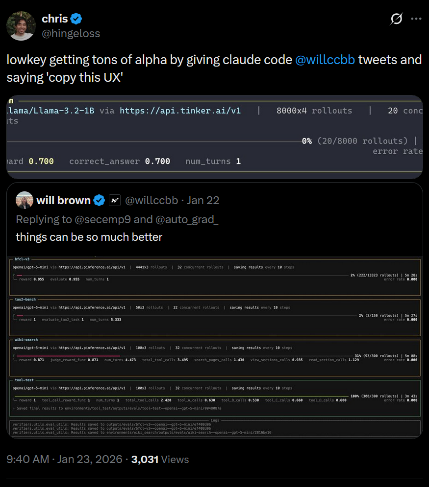

---
title: Towards Automating RL Environment Training
author: Chris Hua, Amit Patel
date: '2026-02-05'
description: 'Opensourcing easier training over RL environments'
slug: towards-automating-rl-env-training
categories: [articles]
tags: [agents, rl, infra]
--- 

We're open-sourcing our fork of [Harbor](https://github.com/laude-institute/harbor), an RL environment sandboxing platform, that adds support for scalably doing RL training with Modal and Tinker.

## Context

Reinforcement learning is all the rage today for pushing the frontier of our LLMs. Teams build environments that simulate some task, and teach the models how to navigate and work with those environments. We've been experimenting with benchmarking and training over these environments, and are open-sourcing some of our improvements.

Harbor is a framework that enables sandboxed environments - agents get access to a docker container and filesystem and are asked to do a task. They write the result(s) to disk, which are then graded by a validator. Environments on Harbor can be run with different backends, e.g. local Docker or remote containers on Modal or Daytona. Harbor is relatively flexible - most functions are performed by shell scripts which by nature can run pretty much anything. 

At the same time, it's important for researchers and RL environment builders to be able to prove that training on their environments helps improve some benchmark. Generalization in RL is not very well understood (as some say, the [frontier looks very jagged](https://www.oneusefulthing.org/p/the-shape-of-ai-jaggedness-bottlenecks) right now), but extremely valuable to resarch and understand.

[Tinker](https://thinkingmachines.ai/tinker/) is very useful as a result: Tinker charges only for active GPU time. In some of our examples, we have 60+ minute runtimes, of which 90%+ is waiting for code execution and a GPU would be idle. At very large scale, the biggest labs have enough tasks running that they can efficiently overlap and utilize the compute effectively, but for everyone else, Tinker is a godsend. Conversely, Tinker may not be as cost-efficient for eg SFT tasks that can easily achieve higher GPU utilization.

We hope this code (or documentation) can help spur more RL research and environment development. [Github: tincans-ai/harbor](https://github.com/tincans-ai/harbor).

## Contributions

We have been working on some extremely difficult (but still verifiable) RL environments. To support experiments in this vein, we added various features to Harbor that we found very useful for our benchmarking and training tasks. 

### Multi-turn RL

DeepSeek-R1, arguably the first open reasoning model, trained using a single-turn reward framework. Given a problem, generate a (long) response and score that response on if it answered the question, in a single shot.

<!--  -->

Of course, allowing a model to have multiple tries at a problem, particularly a hard problem, might help training: perhaps the model can make partial progress (see eg [Zelikman 2022](https://arxiv.org/pdf/2203.14465) or [Liu et al 2025](https://arxiv.org/abs/2507.14295)) and learn from that. DeepSeek R1 implicitly learns something similar - their 'aha' moment, where the model begins to use 'wait..' as an adjustment, but multi-turn can be useful, particularly if we have some notion of process feedback, that can help gauge if the model is on the right track.

We add support for a 'checker' in Harbor, i.e. a shell script built into the environment, which agents are made aware of via system prompt. This means they can enter `/check` to the environment, which will then run a script to test the agent's output. The checker script is researcher-defined and arbitrary, and just needs to print feedback for the agent to stdout. The results are also saved and viewable in the UI.

In our use-cases, we have a problem definition similar to those in [MLE-Bench](https://github.com/openai/mle-bench), which asks agents to train ML models and measures their performance via the quality of the trained model on a test-set. You can imagine an agent working with the training data for a problem (analyzing then training a model), running `/check` to score the model on the test set, and finally scoring on the completely held-out validation set. 

We've added a naive example from the Tinker cookbook where the models play '20 questions.' Surprisingly they are not that good at it?

But there are other more challenging problems that can benefit from intermediate checks. There's really interesting research to be done here. Does it help to give the model the test set, or what if we even gave it the validation set (in a similar vein to [Qu et al 2025](https://www.arxiv.org/abs/2601.18779))? Scientific research is a good example of a multi-turn problem (you could check if your experiment succeeded multiple times, or run many experiments) - but should we penalize checking too often a la multiple hypothesis penalization? We observe models hill-climb pretty effectively but also overfit - how do we maintain that hill climbing skill but encourage parsimoniousness - could that mitigate the worst reward hacking tendencies we see?

### Training Integration

As discussed, being able to train and experiment with RL environments is very important, and Tinker fits the bill well. The basic mental model for how to do this RL infra is:

- Create tasks / environments for an agent to work in
- Pick number of tasks + runs per task that we want to do (eg `n` tasks, `m` runs per task = `m * n` total runs)
- For each environment-run, run the environment, sampling the current model. Compute and save the reward and trajectory/message history.
- After a set number of tasks have completed, compute the advantages for the different trajectories.
- Update the model.
- Get a new sampling client for the new model, repeat until out of credits.

(thanks Nano Banana for the diagram)

Harbor makes running the environment and computing the reward easy. Tinker makes the sampling and updating easy. Modal makes running the environments in parallel easy. Our code basically just wraps these together and lets us focus on writing environments and training on them.

The code asks you to pick a 'batch' size (defaulted to the number of tasks), number of 'steps', number of runs per task (more is better for variance reduction but also more expensive), and number of training steps per update (defaulted to 1). In this parlance, the equivalent parameters for [Deepseek R1-Zero-Qwen-32B](https://arxiv.org/pdf/2501.12948#subsection.B.4) would be a batch size of 32, with 16 runs per task, and 16 training steps per update. 

DeepSeek notably chooses to wait for 8192 examples (ie 16 batches of 32*16 generations) before updating the model. Their inference pattern is more uniform: no waiting for CPU computation, just generating tons of tokens at once, so they can optimize for throughput. Because we have a lot of CPU waiting time, and Tinker charges per token not per GPU second, we _can_ update more frequently. It might still be advantageous to have a larger batch size to reduce variance, and that would also be pretty easy to setup in this framework. 

We also added **training resumption**, ie storing state in the logs. The 'state' is stored as post-step summaries which point to a most recent checkpoint for the step. Then, we can look at which task-runs for the next/current step are necessary and have completed, and run only the ones that have not completed. At the end of the step we can load all the trials to memory and do the backwards. 

### Example training environments

To test / demonstrate the integration with Tinker, we replicated a few recipes from the [Tinker Cookbook](https://github.com/thinking-machines-lab/tinker-cookbook/tree/main/tinker_cookbook/recipes/math_rl). We provide scripts to 1) generate the harbor envs (similar to [adapters](https://harborframework.com/docs/adapters#2-fork-harbor-repository-and-develop-adapter-code) but lighter-weight for testing), 2) run the training. 

The easiest, for just a few cents, is to watch Llama-1B learn to add two numbers ([link](https://github.com/tincans-ai/harbor/tree/main/examples/tasks/arithmetic)). 

### Artifacts

Our environments tend to be quite complex and involve many reasoning steps. You can view these as similar to ML engineering/data science problems. For a human to grade these, we need to look at both the code the agent writes and visualize the output of their work. To that end, we add 'artifacts' to Harbor. Artifacts are remnants from the container (either from the agent's code, or generated by a checker/verifier script) that are persisted to our logs. We found these invaluable in debugging agent loops and reasoning about how to improve eg our rubrics or prompting.

### Other QOL improvements

**Provider-subsidized agents**: Part of our workflow is benchmarking frontier agents in our environment, especially in their own harnesses. Many first-party agents (eg Codex, Claude Code, Kimi) have significantly cheaper costs when running on the subscription plan. Specifically, we added Kimi agent integration and added Codex oauth token support. We think it's within the TOS (and spirit of the user agreements) to run remote instances of the agents using their own harnesses and user auth. Excited to share some results soon with these!

**Simplified debug agents**: Harbor ships with Terminus-2, an agent scaffold that heavily leverages the command line for navigating a tmux session. When testing the integration, we wanted to quickly see if we could (for example) teach a tiny model to do basic addition. The Terminus-2 agent would require the model to not only be add two numbers, but to write that to a file using `echo` or another bash tool too, which failed a lot because, well, the model can't even add two numbers reliably. So we added a simpler agent (simple-llm-agent) that takes whatever the model returns and writes that to disk. 

**Modal-specific tweaks**: Harbor works by uploading/downloading files from a filesystem, e.g. uploading training data or downloading the logs for a run. One amusing issue we ran into was that jobs on Modal were seemingly taking forever to run. I was honestly very stumped and asked Claude to find the issue (without a helpful prompt, tbh). I was super impressed that it did: Modal's API exposes a [buffered reader](https://modal.com/docs/reference/modal.file_io#modalfile_iofileio) for the file, similar to Python's `io.FileIO` or Go's `io.Reader` interface. If you run this locally, disk access is cheap and you can make many calls quickly. But if you run this with a remote sandbox, you incur network latency for each sequential read/write, quickly adding up for large files. As far as I can tell, this particular behavior isn't documented anywhere as an issue, so Claude had to have read the function documentation for the interface, realized that the read was slow, and fixed it. We also improved secrets handling, probably.

**Improved viewer UI**: We wanted to visualize the training results (eg reward over time) and other metrics directly in the Harbor job viewer. We could do this in, eg, Weights and Biases, but since we're already logging everything and there's pretty clear/specific structure to our jobs, a custom UI makes sense. We move towards a three-paned interface, switching between runs / tasks / trials, which reduces cognitive switching costs. 

**Basic terminal UI**: similar to the viewer UI, we try and visualize how the run is doing in the terminal. Honestly Claude just one shot this after giving it a screenshot from what Prime Intellect made.

## On the state of agentic coding

We forked this repo and are open-sourcing it, but intend to maintain it as a separate fork. The priority is iteration speed for our experiments rather than writing amazing reusable code, and believe most of the value of upstreaming commits comes from sharing  specific ideas/problems now that coding agents are so good. If you prompted Claude with this blog post, it could probably implement most of the changes already. The human role feels a bit more like running the code, thinking about how to make the experience better / debugging, and then doing so (for now).

The hard parts of software engineering no longer appear to be the actual 'hands on keyboard' coding but the ideas and the supervision. We are basically all just product managers now! In the past, we would architect 'libraries' and 'frameworks' that a user might be able to drop-in and use. This would save coding time and be predictable (previous bottleneck) but come at the cost of flexibility and customization. Maybe you want to change the return type of a function from a float to an int - you can't easily update the code, so you have to write and maintain a service that does that translation for you. The predictability and correctness of good human code is still not quite matched by LLMs, but I think this is only a matter of time, and most human code isn't that good anyways. 

So - we think the value of this work is largely in 1) giving some good ideas for eng/QOL features, and 2) saving other people some tokens with at least a starting point for the implementation.

