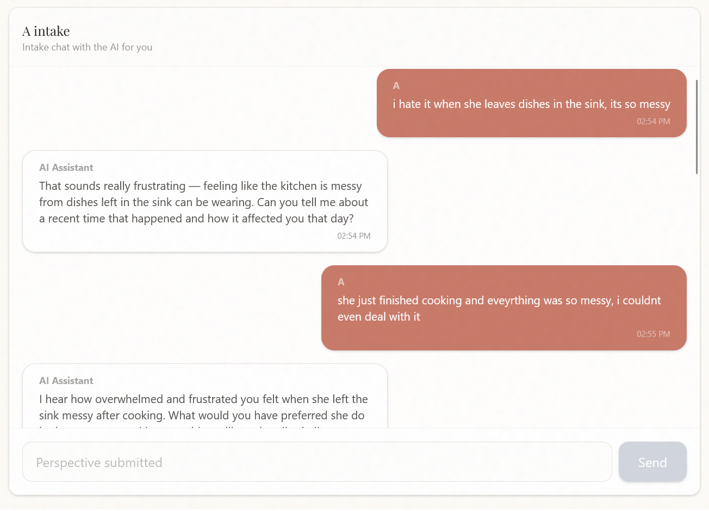
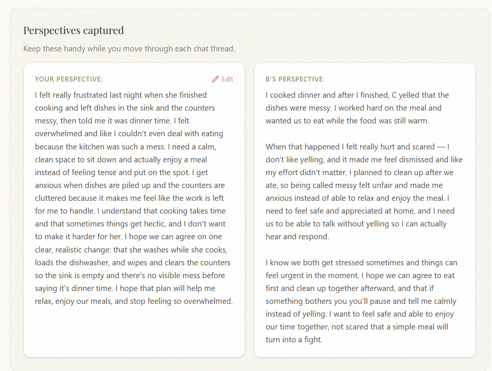
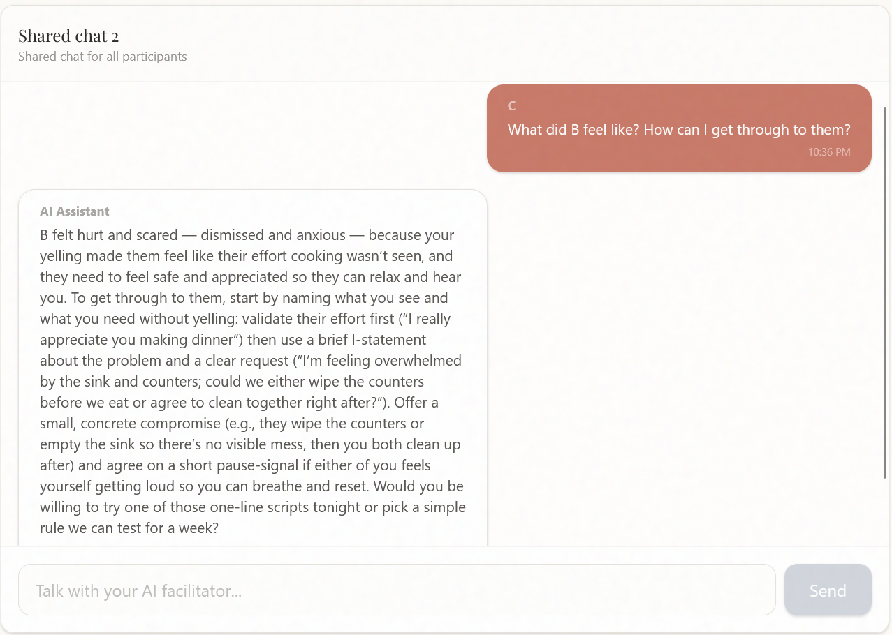
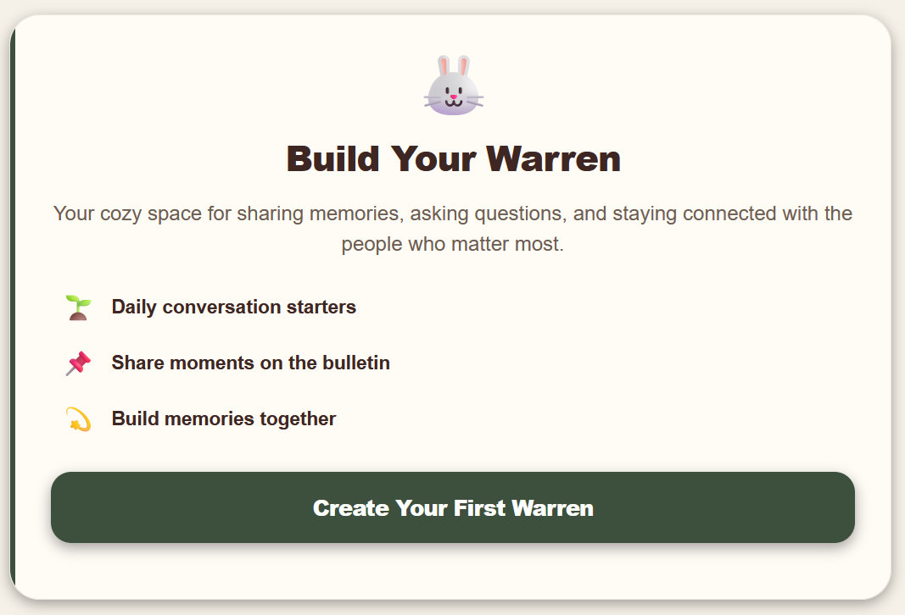

For a pile of sand, people really seem to think LLM’s are good at understanding human emotion and psychology. I certainly agree that they’re helpful. But as an AI researcher, I know that RLHF training pushes them towards responses that people like - not necessarily what they need to hear. Sycophancy is problematic in many areas, but especially when trying to resolve conflicts: if both parties talk to a sycophantic LLM, they will get more entrenched in their views.

In real life, how do we deal with this tendency? One is to turn to mediators who can help us communicate, highlight common ground, and challenge us. 

## The actor-observer problem

When you're emotionally involved in a conflict, you crave validation. An AI that says "you're absolutely right to be angry" feels helpful in the moment to you, but a third-party might recognize it as self-reinforcing advice on a distorted view.

This pattern appears across high-stakes domains:

* In medicine, patient satisfaction correlates with worse outcomes. For example, [Fenton et al 2012](https://pubmed.ncbi.nlm.nih.gov/22331982/) found the most satisfied patients have **26% higher mortality rates** because doctors who maximize satisfaction often acquiesce to clinically harmful requests, such as unnecessary antibiotics, opioids, or imaging. Evidence-based medicine requires saying "no," which feels like bad service but delivers better care.
* In education, the most entertaining professors don't necessarily teach the most. Students rate charismatic instructors highly even when learning nothing, as shown in the "Dr. Fox Effect" ([Ware 1975](https://pubmed.ncbi.nlm.nih.gov/1120118/)). Rigorous teachers who challenge students often get lower ratings despite producing better outcomes.
* When reasoning about a friend's dilemma, participants displayed high levels of "wise reasoning," defined as intellectual humility, recognition of how situations change, and consideration of multiple perspectives. When faced with the same scenario applied to themselves, these cognitive capabilities collapsed. The authors called it [Solomon's Paradox](https://pubmed.ncbi.nlm.nih.gov/24916084/) after the famous Judgement of Solomon.

So this poses a real problem for LLM developers: if user satisfaction doesn't correlate with better outcomes, and there aren't objective verifiers, how can we get effective feedback? One approach is to observe the downstream impact of the feedback, and another is to ask others what they think of the replies.

## Kintsugi

So - I built a [little app](https://kintsugi-ai.vercel.app) that showcases this experience. Kintsugi is a conflict resolution app that uses an AI as mediator. The bot should be able to help individuals feel heard and calmer, and help the partners see each others’ side and think of ways to resolve the conflict.

Each user has an individual conversation to share their own perspective, similar to an initial intake session.

Afterwards, we can summarize the initial conversations into statements that can be shared with the other person.

The summaries can also be fed to an LLM, and users can asynchronously ask questions where the LLM has context on the partner. More talking results in better context to draw on in the future.

Ideally this experience would be conducted over voice. Speech is a much more natural medium for talking about difficult situations, and would likely elicit more natural statements. Alas, not that easy to vibecode. 

To be clear, this is a POC, not a productionized app. Please don't insert any data that you care about keeping private (no HIPAA compliance here). I was able to vibecode it in about a day, thanks to [Convex](https://convex.dev/referral/CHRIST1291) being super easy to scaffold with.

## Designing feedback loops

Kintsugi is mostly an illustrative example; the interesting insight here is how we collect feedback, and what feedback we can collect. Within that design, some examples of questions we can ask:

* **Read your partner's intake conversation with the bot.** After reading it, how much more do you understand your partner's perspective?
    - This should score highly if the bot is able to ask good questions and elicit deeper responses from the partner.
* **Read a shared context conversation that your partner had with the bot.** Did the bot help them see your side? Did it challenge their framing appropriately?
* **After several rounds of discussion, consider how you feel.** Did the conversations help resolve your conflict? 
    - This is the feedback signal that ultimately really matters. It's economically valuable, long-horizon (multiple conversations), and difficult to get in controlled settings otherwise.

At large enough scale, these features would be useful in an RLHF training loop (eg as pointwise data for a reward model). This data is extremely difficult to scale otherwise, and wouldn't be easily gradable by an LLM. 'Good responses' have levels of personalization and emotional understanding that are hard to get through traditional data labeling workflows. 

Additionally, we'd be able to train on speech. Current speech models don't handle emotion well, both in terms of failing to understand the emotion a user speaks with, as well as failing to adapt the output voice tone to match the emotional tenor. ChatGPT's voices are very realistic and it's often fun to listen to an upbeat valley girl with vocal fry: but not when discussing serious topics. The fundamental problem is a lack of data, and emotional audio is difficult to collect -- unless you build an environment specifically for it.

## It takes two

This idea started off as focused on a couples app. The AI mediation chat would have been a feature, but the core loop would focus on sharing facts about yourself, date planning, and other lower stake actions. 

I thought that would have been a very promising direction:

1. AI (and humans) need context. Building gamified daily loops allows the mediation to be preventive rather than reactive. Most couples therapy fails because it's 'too little, too late.' But sharing information about yourself over a period of time (while things are good) builds lots of context that a mediator can draw on.
2. Clear feedback loops for non-verifiable outcomes. We can collect direct feedback from participants, on how well they're understanding the other person, as feedback for the app and LLM. Additionally, we would get indirect feedback from usage/retention. 
4. I doubt a frontier lab would divert their attention to build a de noveau user experience for this kind of TAM. But similarly, few competitors would have the ML knowledge to attempt a similar continuous training paradigm.

I lost motivation for this direction, however, for reasons you may be able to guess.

## The opportunities

More broadly, I think that there's a lot of edge left in designing good feedback loops, particularly around non-verifiable problems. Companies like [General Intuition](https://techcrunch.com/2025/10/16/general-intuition-lands-134m-seed-to-teach-agents-spatial-reasoning-using-video-game-clips/) are interesting, because they're starting with a platform of scaled consumer data and feedback, then betting the AI is easier to build. One way is to think of these as non-verifiable RL environments. What is the most important thing to your customers, especially if fuzzy, and how can you collect the data to help them achieve that? 
 